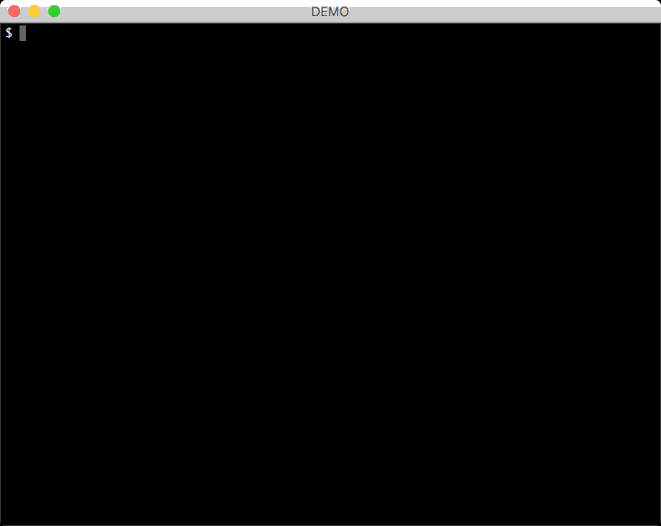

# cpm [](https://travis-ci.org/skaji/cpm)

a fast CPAN module installer



## Install

There are 2 ways.

### 1) From CPAN

```sh
$ cpanm -nq App::cpm
```

### 2) self-contained version

You can also use a _self-contained_ cpm:

```sh
$ curl -sL --compressed https://git.io/cpm > cpm
$ chmod +x cpm
$ ./cpm --version
```

## Description

cpm is a fast CPAN module installer, which uses
[Menlo](https://metacpan.org/pod/Menlo) (cpanm 2.0) in parallel.

Moreover if `--prebuilt` option is enabled, cpm keeps the each builds of distributions in your home directory.
Then, `cpm install --prebuilt` will use these prebuilt distributions.
That is, if prebuilts are available, cpm never build distributions again, just copy the prebuilts into an appropriate directory.
This is (of course!) inspired by [Carmel](https://github.com/miyagawa/Carmel).

## Roadmap

If you all find cpm useful,
then cpm should be merged into cpanm 2.0. How exciting!

To merge cpm into cpanm, there are several TODOs:

* DONE ~~Win32? - support platforms that do not have fork(2) system call~~
* DONE ~~Logging? - the parallel feature makes log really messy~~

Your feedback is highly appreciated.

## License

Copyright 2015 Shoichi Kaji <skaji@cpan.org>

This library is free software; you can redistribute it and/or modify
it under the same terms as Perl itself.

## See Also

* [Perl Advent Calendar 2015](http://www.perladvent.org/2015/2015-12-02.html)
* [App::cpanminus](https://metacpan.org/pod/App::cpanminus)
* [Menlo](https://metacpan.org/pod/Menlo)
* [Carton](https://metacpan.org/pod/Carton)
